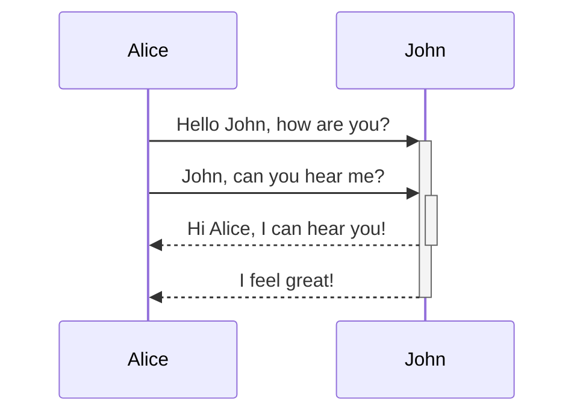
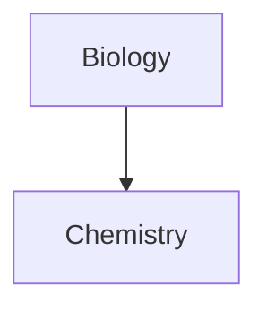

You can add diagrams and charts to your notes, using [Mermaid](https://mermaid-js.github.io/). Mermaid supports a range of diagrams, such as [flow charts](https://mermaid.js.org/syntax/flowchart.html), [sequence diagrams](https://mermaid.js.org/syntax/sequenceDiagram.html), and [timelines](https://mermaid.js.org/syntax/timeline.html).

Tip

You can also try Mermaid's [Live Editor](https://mermaid-js.github.io/mermaid-live-editor) to help you build diagrams before you include them in your notes.

To add a Mermaid diagram, create a `mermaid` [code block](https://help.obsidian.md/Editing+and+formatting/Basic+formatting+syntax#Code blocks).

````md

````


````md

````

### Linking files in a diagram

You can create [internal links](https://help.obsidian.md/Linking+notes+and+files/Internal+links) in your diagrams by attaching the `internal-link` [class](https://mermaid.js.org/syntax/flowchart.html#classes) to your nodes.

````md

````


> [!NOTE]
> Internal links from diagrams don't show up in the [Graph view](https://help.obsidian.md/Plugins/Graph+view).


If you have many nodes in your diagrams, you can use the following snippet.

````md

````

This way, each letter node becomes an internal link, with the [node text](https://mermaid.js.org/syntax/flowchart.html#a-node-with-text) as the link text.

> [!NOTE]
> If you use special characters in your note names, you need to put the note name in double quotes.
> 
> ```
> class "⨳ special character" internal-link
> ```
> 
> Or, `A["⨳ special character"]`.

For more information about creating diagrams, refer to the [official Mermaid docs](https://mermaid.js.org/intro/).